# Spuštění Live DVD Debianu ve VirtualBoxu na OA

> Umístění souborů je určeno pro Obchodní akademii Uherské Hradiště, zbytek návodu ale bude fungovat kdekoliv.

1. Spusť VirtualBox a&nbsp;vytvořte nový virtuální stroj 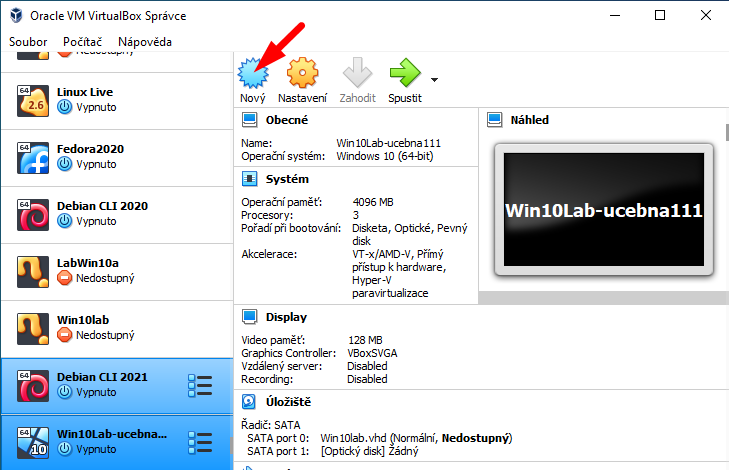
1. Přepni dialog do „expertního režimu“ 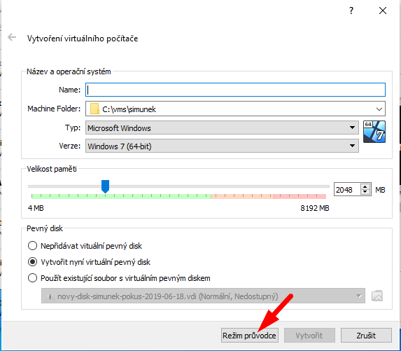
1. Nepřidávej virtuální disk — Live DVD bude startovat z&nbsp;DVD 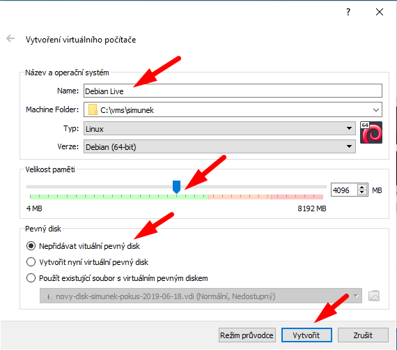
1. Do virtuální DVD mechaniky musíme vložit Live DVD 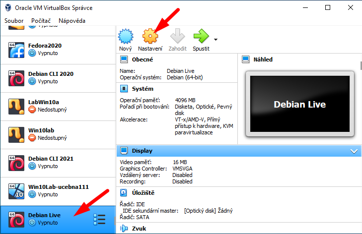
1. Vyber soubor s&nbsp;Live DVD z&nbsp;disku D: 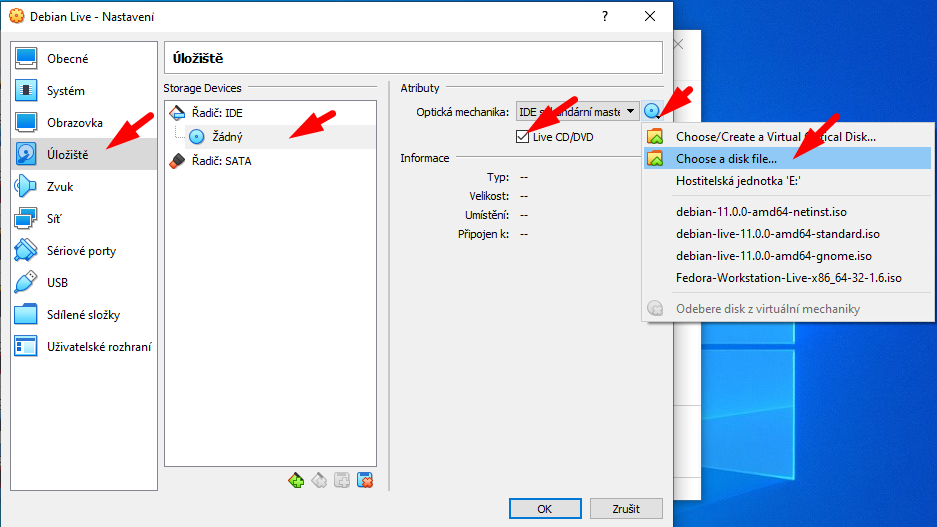
 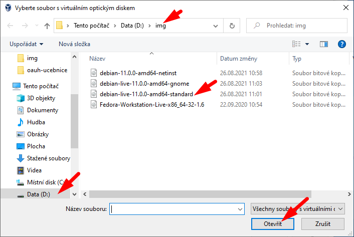
1. Pokud na disku D: soubor není, zkopíruj si ho ze serveru `\\Dilna` 
Doma můžeš Live DVD stáhnout ze stránek: [https://www.debian.org/CD/live/](https://www.debian.org/CD/live/) 
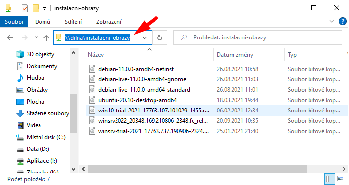
1. Potvrď nastavení 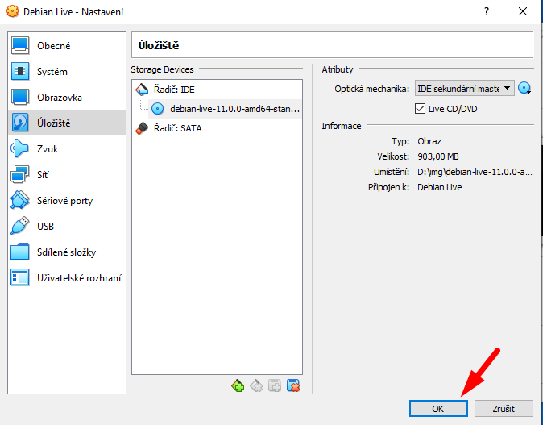
1. Spusť stroj 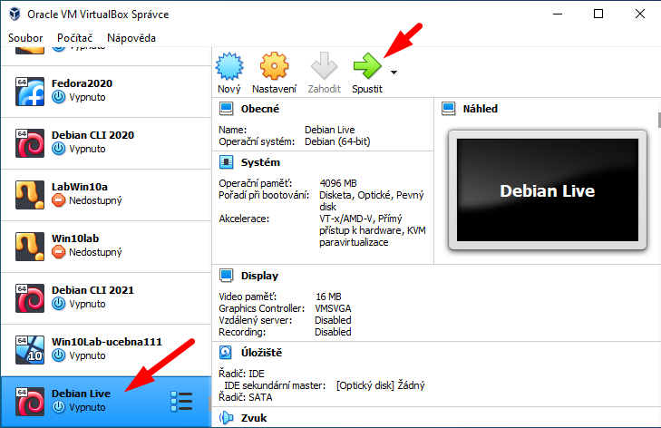
1. Potvrď spuštění Live DVD 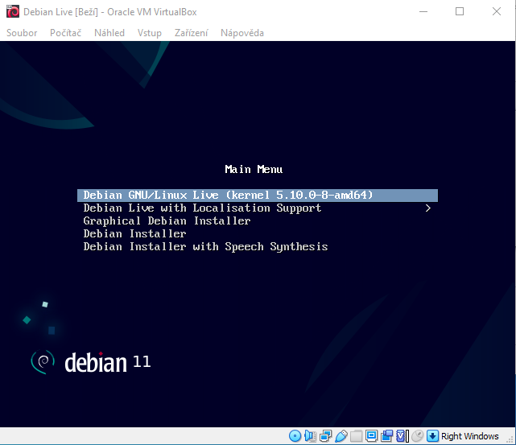
1. Uživatelský účet je `user`, `sudo` lze provádět bez hesla 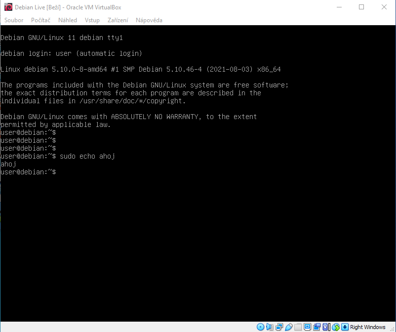
1. Stroj vypneš příkazem `sudo systemctl poweroff` 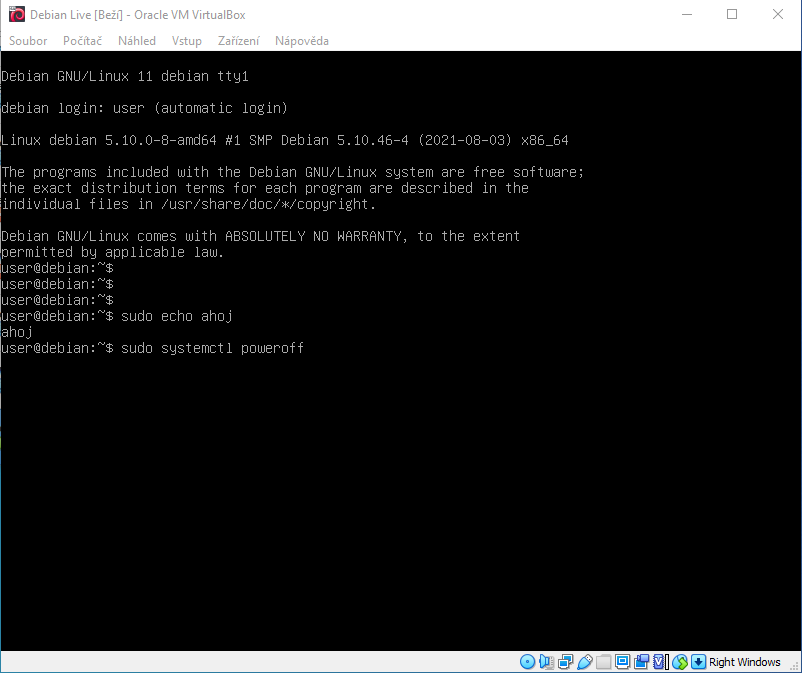
1. DVD není třeba vytahovat (příště budeme opět používat Live DVD), stačí zmáčknout Enter 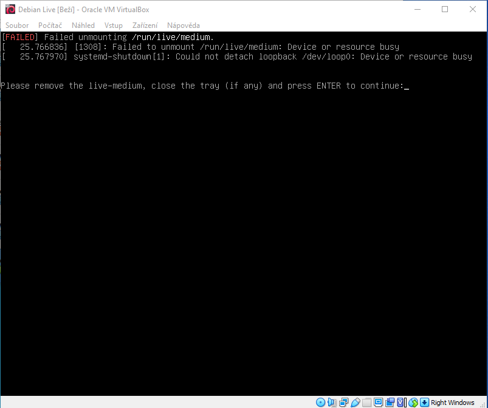
