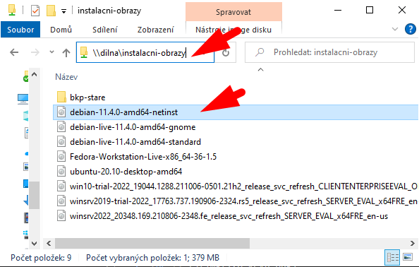
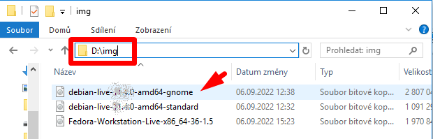
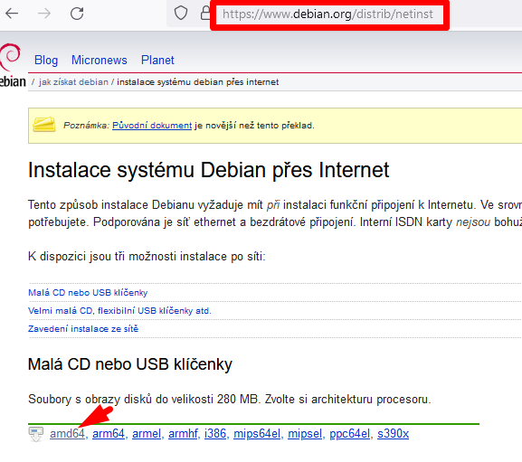
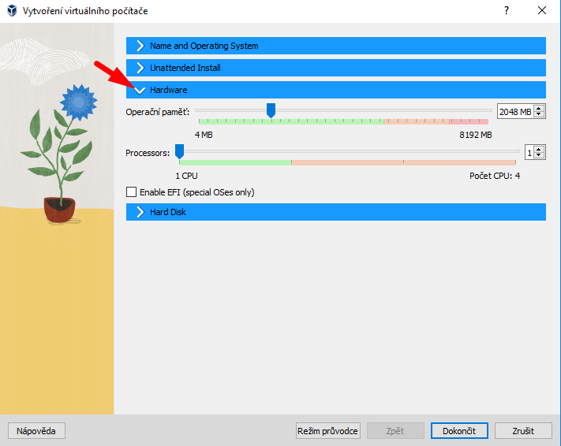
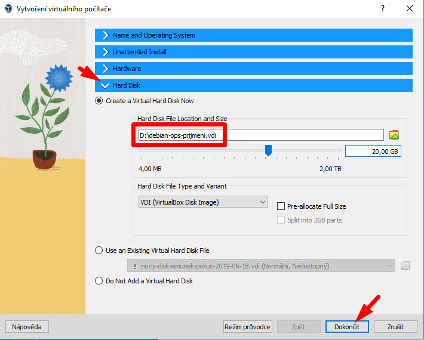
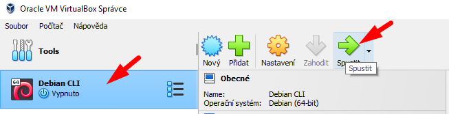
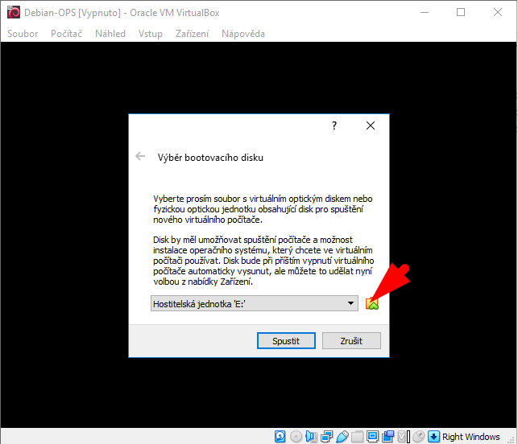
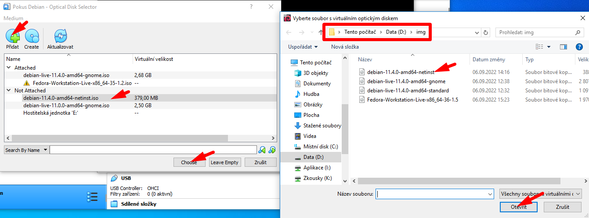
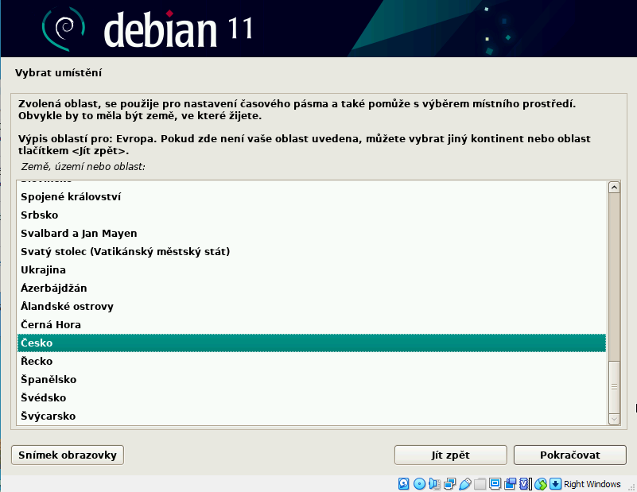

# Instalace Debianu na virtuální stroj

## Stažení obrazu ve škole

Stažení obrazu ve škole (použijte **aktuální verzi**):
1.  
1.  

Stažení obrazu doma:
1. Pokud stahujete obraz doma, použijte stažení varianty <code>netinst</code> (síťová instalace, malé instalační médium) ze stránek [Debian.org](https://www.debian.org): 

## Vytvoření virtuálního stroje
1. Vytvořte nový virtuální stroj ve VirtualBoxu: 
1.  
1.  
1.  
<!---1.  
1.  -->

## Postup instalace
1.  
1.  
1.  
1.  
1.  
1. Název počítače se zobrazí v&nbsp;příkazovém řádku 
_Doma si nastavte, co chcete. Ve škole, prosím, dodržte uvedený vzor. Když školní správce sleduje spuštěné počítače, vidí, že se jedná o virtuální stroj._ 
1.  
1. Přečtěte si důkladně popis! Nezadávejte žádné heslo pro uživatele `root`. Užiavtelský účet `root` tak bude zablokován a instalátor se vás následně zeptá na běžný uživatelský účet, kterému nastaví možnost použít příkaz `sudo`. To je doporučený postup (_best practice_). 
1. Zadejte plné jméno vašeho uživatelského účtu. Je celkem jedno, co zadáte. 
1. Zde zadejte váš login. Je to vaše osobní nastavení, vyberte si, jaký chcete. Ale nezapomeňte ho! 
1. Doporučujeme silné heslo, aby si spolužáci nemohli omylem spustit váš stroj. Ale je to na vás. 
1.  
1.  
1. Pro základní výuku práce v CLI stačí jednoduché rozdělení s&nbsp;jednou oblastí. 
_Doma můžete experimentovat i s&nbsp;dalšími rozděleními disku. Na funkci stroje to příliš nemění. Má to smysl u produkčních serverů, kde zaplnění například adresáře `/var` nebo `/home` neohrozí funkci zbytku systému._ 
1.  
1.  
1.  
1.  
1.  
1.  
1.  
1.  
1.  
1. Nyní se instalátor ptá, jaké součásti chcete nainstalovat. 
_Ve škole neinstalujte grafické uživatelské rozhraní &mdash; zbytečně tím zabíráte místo na disku. Navíc se chceme učit pracovat na serveru, kde také GUI nejspíš nebude. Klidně si ale vytvořte doma další virtuální stroje a experimentujte!_ 
1.  
1. GRUB umožňuje při spuštění počítače vybrat správný operační systém a spustit ho. I když máte na virtuálním stroji jen Linux, GRUB nainstalovat potřebujete. 
1.  
1.  

## První spuštění a vypnutí
1. Nyní můžete nastartovat svůj nově nainstalovaný stroj: 
1. Přihlaste se uživatelským jménem a heslem, které jste si nastavili: 
1. Můžete zkoušet práci s&nbsp;příkazy: 
1. Až skončíte, vypněte systém řádně příkazem! 
_Pokud byste prostě jen zavřeli okno VirtualBoxu, je to obdoba vytažení běžícího počítače ze zásuvky. Sice se někdy nemusí stát nic, ale může také dojít k&nbsp;poškození nainstalovaného operačního systému. Sice je to jen virtuální stroj, ale instalovat znovu se vám ho asi nechce... ;)_ 

