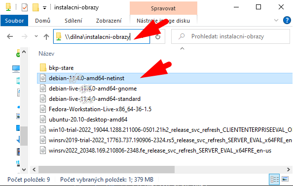
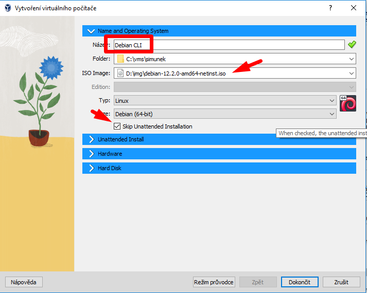
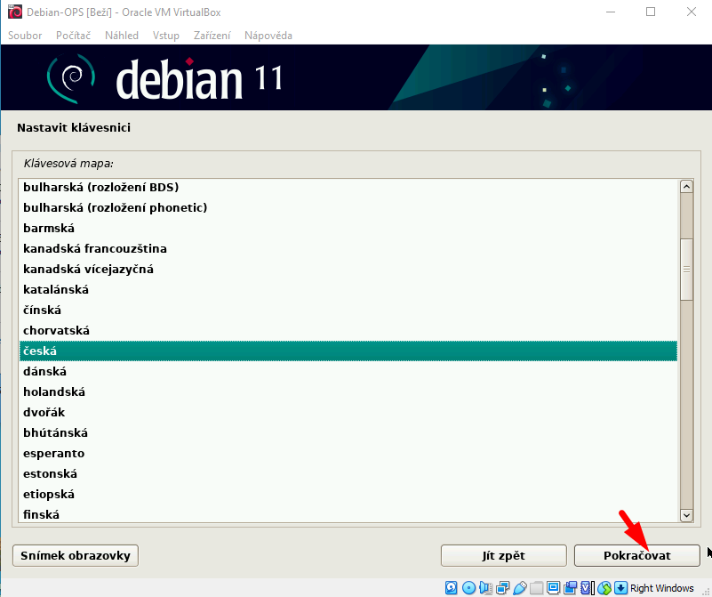

# Instalace Debianu na virtuální stroj

## Stažení obrazu ve škole

Stažení obrazu ve škole:
1.  
1.  

Stažení obrazu doma:
1. Pokud stahujete obraz doma, použijte stažení varianty <code>netinst</code> (síťová instalace) ze stránek [Debian.org](https://www.debian.org): 

## Vytvoření virtuálního stroje
1. Vytvořte nový virtuální stroj ve VirtualBoxu: 
1.  
1.  
1.  
1.  

## Postup instalace
1.  
1.  
1.  
1.  
1.  
1.  
1.  
1.  
1.  
1.  
1.  
1.  
1.  
1.  
1.  
1.  
1.  
1.  
1.  
1.  
1.  
1.  
1.  
1.  
1.  
1.  
1.  
1.  

## První spuštění a vypnutí
1.  
1.  
1.  
1.  

